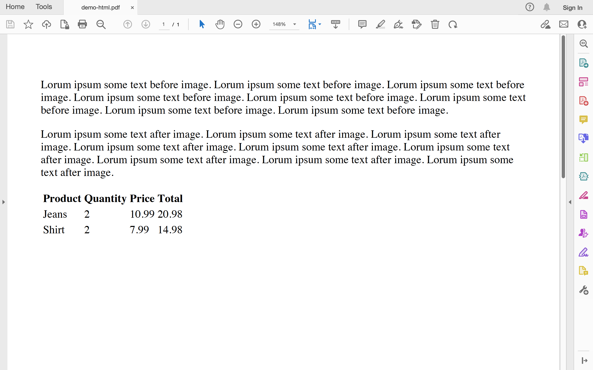
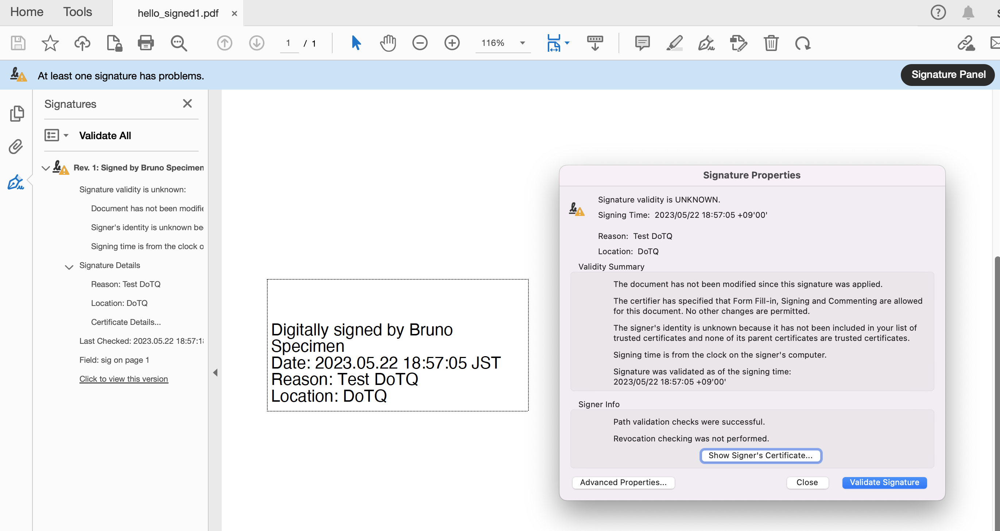

# springboot-itextpdf-signature-demo 🐳


[](https://github.com/tquangdo/springboot-itextpdf-signature-demo/issues/new)

## reference
- [github](https://github.com/itext/i7js-signatures/blob/develop/src/test/java/com/itextpdf/samples/signatures/chapter02/C2_02_SignHelloWorldWithTempFile.java)

## HTML->PDF
1. ### import
    `import com.itextpdf.html2pdf.HtmlConverter;`
1. ### main() function
    `HtmlConverter.convertToPdf(new File("./pdf-input.html"), newFile("demo-html.pdf"));`
1. ### pom
    ```xml
    <!-- <dependency>
        <groupId>com.itextpdf</groupId>
        <artifactId>itext7-core</artifactId>
        <version>7.1.1</version>
        <type>pom</type>
    </dependency> -->
    ```
1. ### run
    ```shell
    mvn spring-boot:run
    ```
1. ### output
    - create `demo/demo-html.pdf` without signature
    

## Signature
1. ### import
    `import com.itextpdf. ...;`
1. ### main() function
    ```java
    DemoApplication app = new DemoApplication();
	app.sign(SRC, DEST + RESULT_FILE, chain, pk, DigestAlgorithms.SHA256,
	provider.getName(),
	PdfSigner.CryptoStandard.CMS, "Test DoTQ", "DoTQ");
	}
    ```
1. ### pom
    ```xml
    <dependency>
        <groupId>com.itextpdf</groupId>
        <artifactId>itext7-core</artifactId>
        <version>7.1.1</version>
        <type>pom</type>
    </dependency>
    ```
1. ### run
    ```shell
    mvn clean package
    mvn spring-boot:run
    ```
1. ### output
    - create `demo/hello_signed1.pdf` with signature `DoTQ`
    